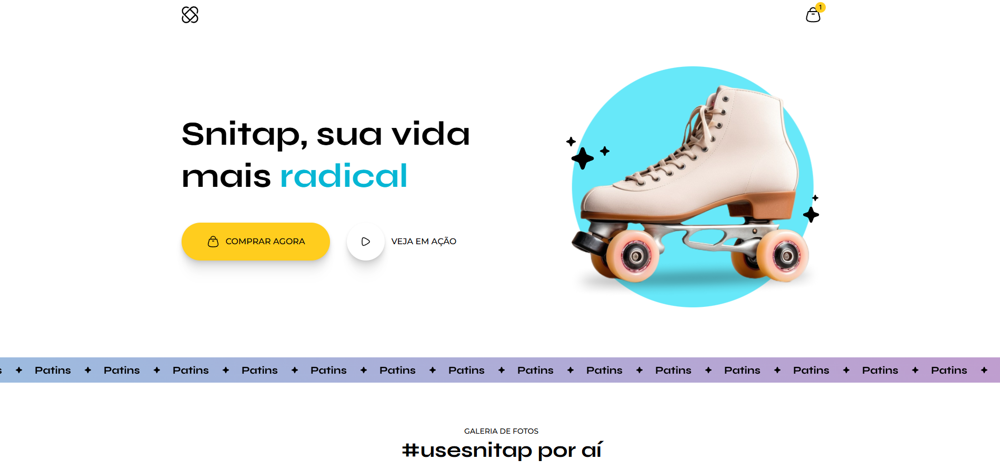

🛼 Snitap - Landing Page Animada

  

Uma Landing Page vibrante e interativa desenvolvida para uma marca fictícia de patins, focada em micro-interações e animações modernas com CSS puro. Desenvolvido durante as aulas da Rocketseat.

💻 Sobre o Projeto
Este projeto consiste em uma página de aterrissagem (Landing Page) totalmente responsiva. O objetivo principal foi praticar conceitos avançados de CSS e a criação de interfaces fluidas e agradáveis ao usuário.

O layout apresenta uma estética moderna ("Vibe Coding"), com cores vivas e transições suaves que guiam a atenção do usuário.

✨ Funcionalidades e Destaques
Animações de Entrada: Elementos que deslizam suavemente ao carregar a página (@keyframes slideIn).

Carrossel de Texto Vertical: Animação infinita no título principal alternando palavras (Radical, Divertida, Saudável).

Banner com Scroll Infinito: Faixa animada contínua usando CSS Animations.

Scroll-driven Animations: A galeria de fotos utiliza a moderna propriedade animation-timeline: view(), fazendo as imagens aparecerem conforme o usuário rola a página.

Micro-interações:

Efeitos de hover em botões, links e ícones sociais.

Sublinhado animado no menu de navegação.

Rotação de ícones e efeitos de escala.

Layout Moderno: Uso de CSS Grid e Flexbox para estruturação.

CSS Nesting: Código CSS limpo e organizado utilizando a sintaxe de aninhamento nativa (&).

🛠 Tecnologias Utilizadas
Este projeto foi desenvolvido utilizando as seguintes tecnologias:

HTML5 (Semântico)

CSS3 (Moderno)

CSS Variables

Keyframes Animations

Media Queries

CSS Nesting

🚀 Como executar o projeto
Clone este repositório:

Bash

git clone https://github.com/SEU-USUARIO/snitap-lp.git
Entre na pasta do projeto:

Bash

cd snitap-lp
Abra o arquivo index.html no seu navegador de preferência.

Dica: Se usar o VS Code, utilize a extensão "Live Server" para uma melhor experiência.

📂 Estrutura de Pastas
/
├── assets/          # Imagens e ícones (SVG/PNG)
├── styles/          # Arquivos CSS modularizados
│   ├── banner.css
│   ├── footer.css
│   ├── gallery.css
│   ├── global.css
│   ├── header.css
│   ├── hero.css
│   └── index.css    # Arquivo principal que importa os outros
└── index.html       # Estrutura principal
🎨 Design
O design foi focado em transmitir energia e movimento, utilizando uma paleta de cores vibrante definida via variáveis CSS:

🟡 Sun: #ffcd1e

🔵 Sky: #06b6d4

💗 Joy: #db2777

🟢 Leaf: #16a34a

💜 Créditos
Desenvolvido por João Pedro com base nos ensinamentos da Rocketseat.
